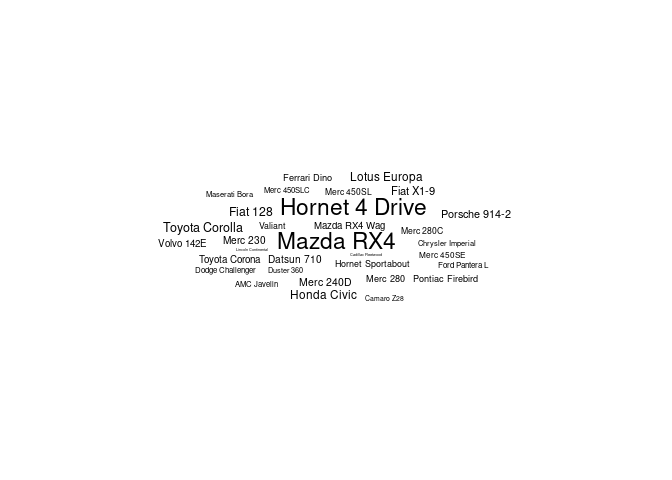
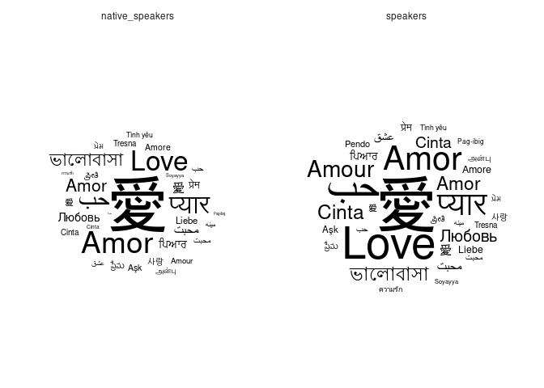
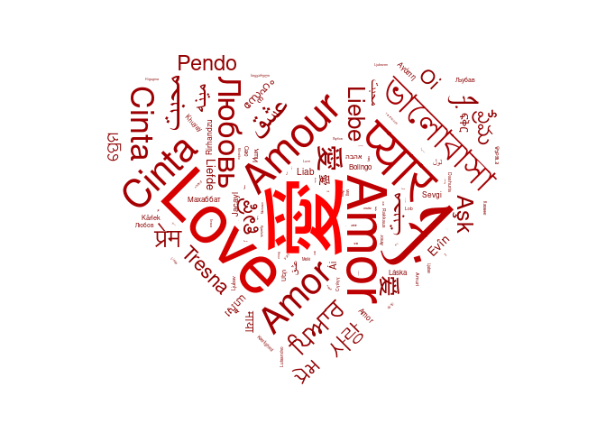

<!-- README.md is generated from README.Rmd. Please edit that file -->

# ggwordcloud 

[](https://travis-ci.org/lepennec/ggwordcloud)
[](https://codecov.io/github/lepennec/ggwordcloud?branch=master)
[](https://cran.r-project.org/package=ggwordcloud)

`ggwordcloud` provides a word cloud text geom for `ggplot2`. The
placement algorithm implemented in C++ is an hybrid between the one of
`wordcloud` and the one of `wordcloud2.js`. The cloud can grow according
to a shape and stay within a mask. The size aesthetic is used either to
control the font size or the printed area of the words. `ggwordcloud`
also supports arbitrary text rotation. The faceting scheme of `ggplot2`
can also be used. Two functions meant to be the equivalent of
`wordcloud` and `wordcloud2` are proposed.

## Installation

You can install the released version of ggwordcloud from
[CRAN](https://CRAN.R-project.org) with:

``` r
install.packages("ggwordcloud")
```

or the development version from the github repository

``` r
devtools::install_github("lepennec/ggwordcloud")
```

# Some word clouds

Because sometimes, pictures are better than a thousand words…

``` r
library(ggwordcloud)
#> Loading required package: ggplot2
data("love_words_small")
set.seed(42)
ggplot(love_words_small, aes(label = word, size = speakers)) +
  geom_text_wordcloud() +
  scale_size_area(max_size = 24) +
  theme_minimal()
```



``` r
suppressMessages({
  library(dplyr)
  library(tidyr)
})
set.seed(42)
ggplot(
  love_words_small %>%
    gather(key = "type", value = "speakers", -lang, -word) %>%
    arrange(desc(speakers)),
  aes(label = word, size = speakers)
) +
  geom_text_wordcloud_area() +
  scale_size_area(max_size = 20) +
  theme_minimal() +
  facet_wrap(~type)
```



``` r
data("love_words")
set.seed(42)
ggplot(
  love_words,
  aes(
    label = word, size = speakers,
    color = speakers
  )
) +
  geom_text_wordcloud_area(aes(angle = 45 * sample(-2:2, nrow(love_words), replace = TRUE)),
    area_corr_power = 1,
    mask = png::readPNG(system.file("extdata/hearth.png",
      package = "ggwordcloud", mustWork = TRUE
    )),
    rm_outside = TRUE
  ) +
  scale_size_area(max_size = 25) +
  theme_minimal() +
  scale_color_gradient(low = "darkred", high = "red")
#> Some words could not fit on page. They have been removed.
```



More examples are available in the vignette.
